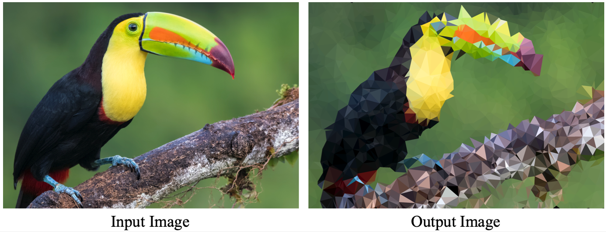
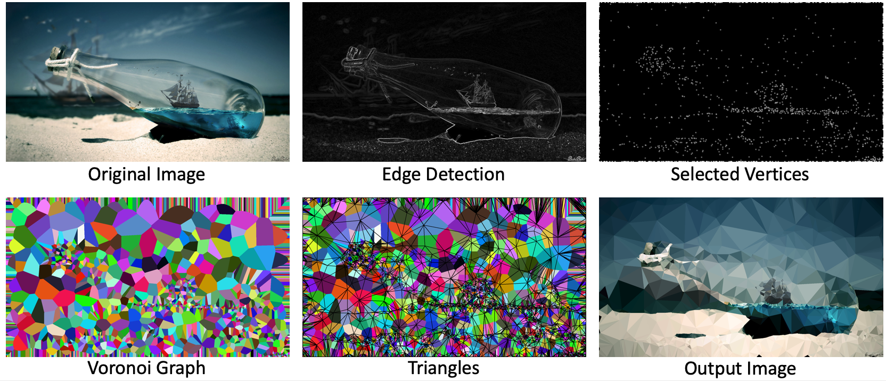
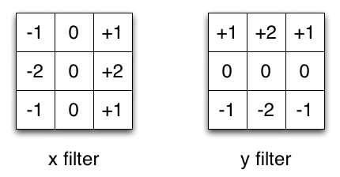
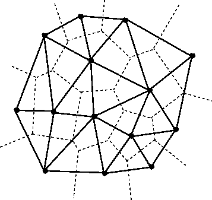
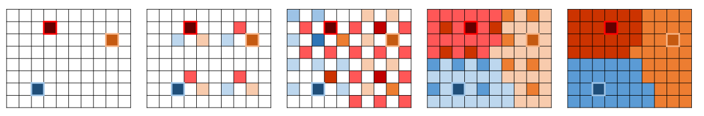
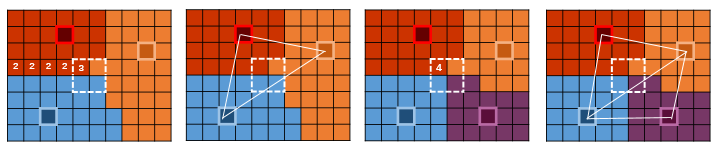
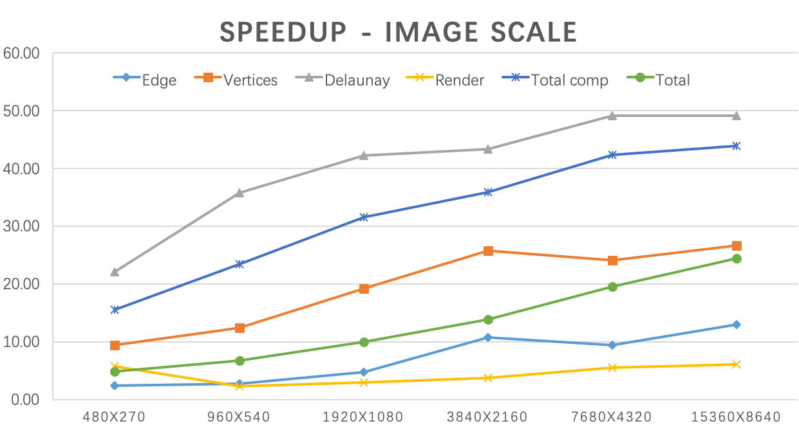
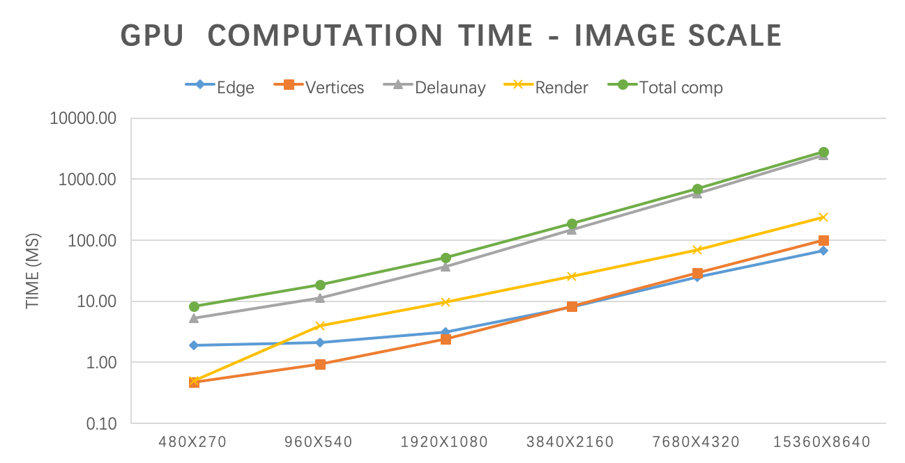
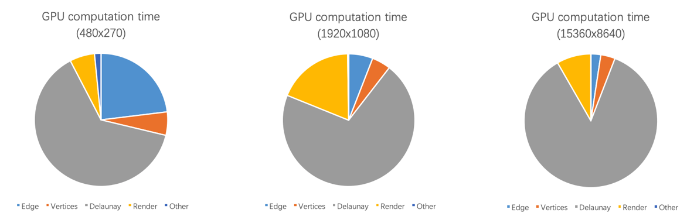
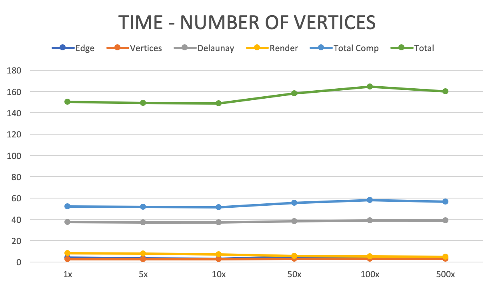

# Parallel Low Poly Style Image/Video Converter
### Weichen Ke & Zhengjia Huang

at: [https://darkforte.github.io/LowPoly/](https://darkforte.github.io/LowPoly/)

<!--[**Project Checkpoint**](https://darkforte.github.io/LowPoly/checkpoint/checkpoint.html)-->

## Summary

We implemented a parallel low poly style image converter on CUDA. It accepts a picture of any size and converts it to a composition of many single colored triangles. We implemented the workflow of the converter on both CPU and CUDA and tested it on pictures and videos of different sizes. Experiments showed that our CUDA implementation can achieve ~50x speedup compared to the CPU version when the image is large. And our video version can achieve close to real-time speed (~25fps) on 720p video. 

## Background and Motivation



Low Poly Art is an art style that expresses objects with only a limited number of polygons. It was introduced in early-stage computer games when the computers were not so powerful as they are today. Nowadays, Low Poly Art becomes a popular style in modern design because it brings a unique abstract and retro-style aesthetic value. There are many converters that can convert an image to low poly style. They are very helpful for designers who need generating low poly style pictures, artists who are looking for new ideas, or ordinary people who do this just for fun.

The main workflow of making a low poly style picture involves three steps:

* **Point Selection** spreads a series of points on the picture and preserves the structure of the image. The easiest way to do it is to spread the points uniformly on the picture. However, in order to preserve the picture structure, it would be better to first extract the edges in the picture, then spread more points on the edges than the other parts.

* **Triangulation** connects the points to form a non-overlapping triangle mesh. The most common algorithm is Delaunay Triangulation (DT). This is the most tricky part of the workflow, which will be explained in detail later.

* **Rendering** re-draws the picture using the triangle mesh. Usually, it renders each triangle to the color at its center.

All three parts can benefit from parallel execution on GPU. Among them, Delaunay Triangulation (DT) is the most computationally expensive part, and it is more tricky to parallelize than the other two. DT refers to a triangulation on a set of points so that no point is inside the circumcircle of another triangle. A common DT algorithm for CPU is the Bowyer–Watson Algorithm. The workflow of this algorithm is:

1. Add a super triangle that includes all the points;

2. Iteratively add points to the current triangle mesh. As shown in the following picture, adding a new point will form three new triangles. Then, it checks whether there is a triangle whose vertex is in the circumcircle of the new triangle (thus violating the Delaunay condition). If yes, then the common edge of the two triangles is flipped.

   

3. Keep adding the points. After adding all the points, removing the super triangle gives the DT of the points.

This algorithm is straightforward, but it is hard to parallelize. The reason is that this algorithm is essentially iterative, and parallelizing it will introduce huge contention. For example, because the algorithm follows a coarse-to-fine procedure, many points will locate inside large triangles during the early stage. We cannot explore two points simultaneously if they are in the same triangle, because both points want to divide the triangle and this will result in overlapping edges. This restriction severely hampers the potential for parallelism of this method.

Some previous attempts used the divide and conquer algorithm to leverage the parallelism in it. For example, Prakash implemented an [OpenMPI version of DT](https://cse.buffalo.edu/faculty/miller/Courses/CSE633/adarsh-prakash-Spring-2017-CSE633.pdf) with the divide and conquer algorithm. The basic idea of the algorithm is to split the points into two areas, do DT in each area, then merge the points on the borders. Although natural to parallelize, this algorithm is much harder to implement, and the communication overhead between processors has a great impact on the overall speedup. Even if data fits in a single machine, using 32 cores can only bring 5x speedup.

Since these methods are hard to parallelize, we used a third algorithm that is more suitable for parallel machines. The basic idea is to first compute a Voronoi Graph (VG) of the original picture, which is known to be the dual problem of DT, then obtain the DT with the computed VG. Computing VG can be parallelized on GPU. We will explain the details in the next section.

## Methods

### Overview

Here is an illustration of our workflow. It consists of several steps:

1. Detect the edges of the picture, to better choose the points to preserve the picture structure;
2. Randomly choose points, with more probability on edges than other parts;
3. Compute the VG of the points;
4. Obtain DT mesh from the VG;
5. Render the triangles and produce the final output.



We developed the whole system from scratch with C++ and CUDA on GHC machines with GTX 1080 GPU. We also used OpenCV for some helpers like CPU edge detection, reading and storing images/videos.

### Edge Detection

To better preserve the texture in the original image, we need to find edges in the image. We implemented the Sobel edge detector in CUDA to find edges. It calculates the horizontal gradient and verticle gradient for each pixel respectively. We only preserve the absolute value of the gradient to represent the edginess score. To further increase efficiency, we used linear approximation $g_i=\frac{1}{2}|g_{i,x}|+\frac{1}{2}|g_{i,y}|$ to replace the true gradient. The algorithm reads from the original image and writes its output to a new empty image. Because there is no contention, we could simply parallel the process by pixel. We didn't observe more speedup using shared memory for edge detection. The reason is that our filter size is small hence we only reuse pixel values a few times. This reuse can barely compensate the time of copying data into shared memory. 

<div style="text-align:center"></div>
<!---->

### Vertices Selection

Vertices selection takes image gradients (edge detection result) as input and outputs an image with the same size where each pixel is set to either -1(not selected) or a Point(row, col) structure (this pixel is selected). Every pixel has a probability to be selected as a vertex. For edge pixels detected in the edge detection process, we give them a higher probability to better preserve the texture of the original image. For pixels at the boundary of the image, we also give them a higher probability to make sure our triangulation algorithm better cover the boundary of the image. We used the "curand" package to generate random numbers. Because our algorithm doesn't require high-quality random numbers, we set the scramble and offset values to be both zero: `curand_init(id, 0, 0, &state[id])` for maximum speed. We paralleled the vertices selection process by pixel.

### Voronoi Graph

For triangulation, we used an algorithm that is proposed by [Rong et al](http://citeseerx.ist.psu.edu/viewdoc/download?doi=10.1.1.632.1946&rep=rep1&type=pdf). The basic idea is, instead of directly computing DT, we first compute the [Voronoi Graph (VG)](https://en.wikipedia.org/wiki/Voronoi_diagram) of it on the picture. VG is a partition of a plane into regions according to their nearest points. VG is the dual problem of DT. If we obtained a VG (dashed lines), then connect the points of adjacent regions of the diagram gives us the DT (solid lines). 

<div style="text-align:center"></div>
<!---->

Computing VG on a picture is done by the Jump-Flooding algorithm, which will mark each pixel with its nearest neighbor point. In each iteration with a step size $k$, a pixel $(x, y)$ will look at its eight neighbors $(x+i, y+j)$ where $i, j \in \{-k, 0, +k\}$, and try to find a closer point to it. The pseudo code for Jump-Flooding algorithm is:

```
owner = {}
step = picture_size / 2
while step>=1:
    for pixel_A in pixels:
        for pixel_B who is (step) away from pixel_A:
            if pixel_A has no owner, or owner[pixel_B] is closer than owner[pixel_A]:
                owner[pixel_A] = owner[pixel_B]
    step /= 2
```

Here is an illustration for the steps for the Jump-Flooding algorithm on three points, with initial step = 4.



This algorithm is very GPU friendly since we can parallel the computation by each pixel. We can map each pixel to a thread on GPU, and each thread looks at the eight neighbors and update their owner points. Each step size requires a kernel launch, so there will be $\log{N}$ kernel launches where $N$ is the larger size of the picture. We can use double buffers to implement this algorithm since the updating process is fully synchronous. There is no contention in this algorithm. (In practice, we did not use double buffering. See side notes below for details.)

### Generating Triangles

After getting the VG, there is a neat trick to generate the triangle mesh in a fully parallel way. It turns out that the pixel map is sufficient to construct the triangles. Specifically, our task is to find 2x2 squares in the pixel map that have 3 or 4 different owners. A square of 3 owners suggests those 3 regions intersect here, so one triangle should be generated to connect the 3 regions. Similarly, a square of 4 owners suggests there should be two triangles to connect the 4 regions. Here is an illustration of this process. The number in the pixel refers to the number of owners in the 2x2 square.

<div style="text-align:center"></div>
<!---->

Since we cannot dynamically add triangles in CUDA, constructing the triangle mesh is a three-step process:

First, we compute the total number of the triangles and assign each pixel with their triangle indices. This can be done by mapping each pixel to a thread, then each pixel checks itself and the three pixels on its right, bottom, and bottom-right. If the total number of different owners is 3, then mark the pixel as 1; or if it is 4, them mark the pixel as 2. Otherwise, it is 0. 

After that, we produce an exclusive scan to get the prefix sum of the pixel map. The exclusive scan gives the total number of triangles and the index of each pixel. For example, if `prefix_sum[pixel_A] = 10`, and `prefix_sum[pixel_next_to_pixel_A] = 12`, we know that pixel_A has two triangles: the 10th and the 11th. We use `thrust::exclusive_scan` to carry out this process.

At last, we allocate an array whose length is equal to the number of triangles, then launch another kernel in which every pixel puts their triangle to the corresponding indices.  

The whole process in generating triangles does not contain any contention since all information a pixel relies on is the pixel map generated in the previous step.

### Rendering

We first tried to parallel by pixel and loop through triangles. However, the performance was bad. We quickly realized that the triangles are not overlapping with each other so that we don't need to worry about the order of triangles. We then decided to parallel by triangles and for each triangle, only loop through local pixels that locate in its bounding box. To determine if a point is inside a triangle, we implemented the following procedure: given a point and a triangle, (i) loop through the three vertices of the triangle in any order (clockwise or counter-clockwise) hence every pair of vertices determines a directed edge (ii) for each edge, determine if the point is to its left or right side (iii) if the point is to the same side of all three edges, then it is inside the triangle. If a point is inside a triangle, we color it with the color defined at the center of the triangle.

### Important Data Structures

* Point: 2-D point with integer x (column) and y (row) values
* Triangle: A triangle contains 3 points and a center (the weight center of three points)
* Image: 2-D array stored in contiguous memory space. Each pixel can be a char (gray image), three chars (RGB image), a point (Voronoi map), etc.

### Side Notes

* It is worth noting that our triangulation algorithm is especially suitable for generating low poly arts instead of computing general Delaunay Triangulation. Computing general DT in this method requires additional steps on mapping the points to and from a fixed sized texture. Doing so will also include steps like restoring the mapped points to their original coordinates, handling missing points, and flipping edges that violates Delaunay properties. Fortunately, generating low poly arts essentially has a texture and all points are on the texture from the very beginning, so it is unnecessary to map the points, which reduces a lot of trouble. 
* Jump-Flooding algorithm does not always produce perfect Voronoi Graphs. It can sometimes produce "islands" like the following situation. However, it rarely happens and we never observed it crashing the output picture during experiments, so we did not include the step that fixes the islands. This can also be done by parallel pixel examination. 
* In theory, Jump-Flooding algorithm should be implemented with double buffers. However, at first we forgot to implement double buffering, but we always observed correct outputs. We assume the reason is that, without double buffering, the worst outcome of a pixel is to read the other pixel's result of the next iteration, which will not affect the correctness of the algorithm. We are not able to prove that it is 100% correct, but our experiments with this method never output corrupted images. Later on, we implemented double buffering and observed the same output quality with 10% drop on performance, because of extra memory allocation and global memory access. Therefore, we decide to turn in the version without double buffering in the end.
* Sometimes our output picture will have some missing triangles on boundaries (like the output image of the second picture in the report). In order to fix the edges, a standard way is to transfer the image back to CPU and fit a convex hull of all the points. However, we think it is unnecessary because small missing triangles does not hurt the output quality much, but transferring it back and fit a convex hull will significantly increase the computation time. 

## Results

### Speedup




As shown in the above form and graph, we tested our algorithm on 270p, 540p, 1080p, 2160p, 4320p, 8640p images respectively. The CPU version is compiled with `-O3` optimization. We used high precision timer `CycleTimer` as in HW2 to get our profiling data. All the values are in milliseconds. When the image is large, our Delaunay algorithm achieved ~50x speed up and the overall program achieved ~45 times speedup on computation time. If we take Cuda initialization time and disk I/O time into consideration, our algorithm achieved ~24.4 times speedup. We didn't observe a huge speed up on rendering. The reason is the triangles have different sizes (smallest is only 1 pixel) and shapes so that the workloads of different threads are heavily unbalanced.

#### Factors that limited our speedup:
* Multiple running phases and kernel launching. The triangulation step contains multiple phases, each phase cannot start until the previous phase completes. In addition, some phases require multiple kernel launching, like generating Voronoi Graphs requires launching a kernel for every iteration. The synchronization prevents us from reaching perfect speedup. 
* Workload imbalance when generating and rendering triangles. When generating triangles, the workload is imbalanced among threads. Many threads that do not contain triangles return immediately, but they have to wait for the others who need to build and store their triangles.

#### Factors that does not limit our speedup:
* Data transfer. We keep the image data in the GPU memory all the time and minimizing the overhead for data transfer. We profiled the time for copying the image, and it only takes <1% running time.
* Communication. There is no contention in our algorithm, so we avoid all overhead with locks.

### Time Consumption



As shown in the above graph, each part of the GPU computation time grows linearly with the picture size. The number of vertices doesn't influence the speed in our implementation.



The above image shows a breakdown of running time in three pictures. DT computation accounts for the largest part for all of them. 



The above image shows that the overall algorithm is not sensitive to the number of edges. We tested on 1080p image and number of vertices ranges from 1x to 500x. But we do observe a decrease in render time (from 8.19 to 4.81) as the number of vertices increase. The reason is as the number of vertices increase, the number of triangles also increase. This will result in a smaller average triangle size. As triangle size gets smaller, the search area of each thread gets smaller. And most importantly, as the search area gets smaller, the number of "not in triangle" pixels searched by each thread decrease, which results in the speedup.  

### Test on Video Conversion

We further tried to test our converter on video. We load each frame of a video in sequential order and convert it to low-poly style image, then write it in memory. Because all frames in a video share the same resolution, many variables can be reused to further save some time. We tested it on a 720p video and a 1080p video respectively. The results are: 

<center>

|         | ms / frame |  FPS  |
| ------- | ---------  | ----- |
| 720p    | 39.27      | 25.5  |
| 1080p   | 69.42      | 14.4  |

</center>

### Failed Attempts and Ideas

* In parallel triangle generation, we found that a pixel can be accessed multiple times. Therefore, we considered loading the owner array to the block's shared memory before the actual computation. However, we tried it out and the performance did not improve. We suppose the reason is that when reading pixels into shared memory, the workload is actually imbalanced, because while the majority of threads just reads their own pixels, the threads on borders will have to read 2 pixels, and the bottom-right thread will have to read 4. In that way, the overhead introduced by loading data into shared memory will cancel out the benefit of accelerated memory access.

* In vertices selection part, our first version has only one random number generator and we protected it by a mutex. However, this results in a huge amount of contention because every pixel needs a random number and every batch of pixels reach to random number generation at almost the same time. To remove contention, we then decided to assign a random number generator for each pixel. We tried to used `curand_init(id, id, id, &state[id])` (individual seed + scramble + offset) to initialize the generators. It generates high-quality random numbers. However, simply initialize the random number generators on a 1080p image took about 15 seconds. Actually, our algorithm doesn't require high-quality random numbers. So, we set scramble and offset to be 0 when initializing generators. This results in a much faster initialization, which takes only ~2ms.

* We tried to increase granularity (render 2 or 4 triangles in each thread) to solve the unbalanced workload and increase the speedup in rendering. However, as we increase the granularity, the speed decreased. We think the reason is rendering is bottlenecked by the largest triangle. As we increase granularity, the equivalent triangle size of the most unlucky thread (has many large triangles) will increase, which will take longer to render. 


### Work List and Credit Distribution

#### Weichen Ke (50%)

* Propose the workflow for low poly image generation
* Design the algorithm for parallel triangulation and rendering
* Implement the CPU and GPU version of the triangulation process (Voronoi Graph + Triangle generation)
* Fine-tune the performance of triangulation on GPU

#### Zhengjia Huang (50%)

* Implement CPU version edge detection, vertices selection, and rendering
* Implement and fine-tune GPU version edge detection, vertices selection, and rendering
* Transplant CPU version Delaunay Triangulation onto GPU
* OpenCV related API (e.g. Image/Video IO)


## References

[1] Zhang W, Xiao S, Shi X. Low-poly style image and video processing

[2] Qi M, Cao T T, Tan T S. Computing 2D constrained Delaunay triangulation using the GPU

[3] Guodong R., Tiow-Seng T, Thanh-Tung C, Stephanus, Computing Two-dimensional Delaunay Triangulation Using Graphic Hardware

[4] V. Fuetterling, C. Lojewski, and F.-J. Pfreundt High-Performance Delaunay Triangulations for Many-Core Computers