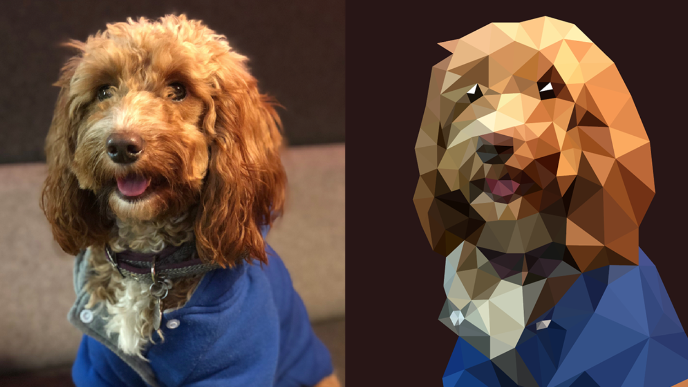

# Parallel Low Poly Style Image Converter

at: https://darkforte.github.io/LowPoly/

## Summary

We are going to implement a parallel low poly style image converter with OpenMP or CUDA. It accepts an input image and transforms it into a low poly style one.

## Background



(Image credit: [How to create low poly art in Adobe Illustrator](https://engageinteractive.co.uk/blog/how-to-create-low-poly-art-in-adobe-illustrator))

Low Poly Art is an art style that expresses objects with only a limited number of polygons. It was introduced in early stage computer games when the computers were not so powerful as they are today. Nowadays, Low Poly Art becomes a popular style in modern design because it brings an unique abstract and retro-style aesthetic value. There are many converters that can convert an image to low poly style. They are very helpful for designers who need generating low poly style pictures, artists who are looking for new ideas, or ordinary people who do this just for fun.

A popular method to convert a picture to low poly style is called [Delaunay Triangulation](https://en.wikipedia.org/wiki/Delaunay_triangulation). Delaunay Triangulation finds a non-overlapping triangulation of a set of points on a plane. The main flow of Delaunay Triangulation is as follows:

```
Input: A set of points on the plane.
Output: A set of non-overlapping triangles
```

1. Add 3 points out of the image plane and connect them into a huge triangle which contains all the points in the image plane.

2. Select a new point from the remaining points.

3. Traverse through all the triangles to find which triangle the point is in.

4. Separate the surrounding triangle into 3 smaller triangles using the new point.

5. Draw the circumcircles of the new triangles. Notice that we can divide each quadrilateral into triangles in two ways:
  * If the other point of the quadrilateral locates inside the sphere, we switch to the other way of dividing the quadrilateral. 
  * If it is outside the sphere, then we keep it.

6. Go back to step 2, until no more points are to be selected.


This algorithm is known to be compute-intensive, but it has some potential to be parallelized. For example, points at different parts may be computed at the same time, and testing which triangle a point is in may also be parallelized. 

We will try to realize the potential of parallelism in this algorithm to make generating low poly style images faster.

## Challenges

* Implicit conflicts. For example, two points inside the same triangle cannot be examined at the same time by two threads. And when switching the division of a quadrilateral, there cannot be other processes that is examining points in the quadrilateral. 
* Communication between threads. If we divide the image into several blocks and assign blocks to threads, we need to figure out a correct and efficient way for the threads to communicate.
* Randomly spreading points onto the picture doe not yield well-looking outputs. To make outputs better, we need some additional work like doing edge detection with Sobel Edge Detector.
* Workload balancing. For aesthetic reason, the points on the image can be unevenly distributed. There may be more points in regions with rich texture and less points in regions with less texture.

## Resources

* There are several existing sequential versions of Delaunay Triangulation, like the one [here](https://github.com/Bl4ckb0ne/delaunay-triangulation).
* There are some former attempts to parallelize Delaunay Triangulation, like https://cse.buffalo.edu/faculty/miller/Courses/CSE633/adarsh-prakash-Spring-2017-CSE633.pdf which uses OpenMPI to parallelize the algorithm. However, we think using OpenMP should be more efficient than using OpenMPI. 
* There are also some discussions on [Zhihu](https://www.zhihu.com/question/29856775) (Chinese) about making better looking outputs.


## Goals and Deliverables

### Expected Goals (Plan to achieve):

* Make a program that loads a picture from disk or camera, and shows the triangulated one on the screen. 
* It should contain the edge detector to make outputs better looking.
* It may not be real-time.

### Minimum Goals:

* Finish the parallel version of Delaunay Triangulation and image input/output features only, without an edge detector. 

### Ideal Goals:

* Make a real-time triangulation converter, which captures video by computer camera and shows the triangulated video in a separate window.
* Or, we can build a webpage that allows user to adjust parameters and generates the output interactively.

## Platform Choice

We are planning to use GHC machines for experiments, and we are planning to use C++ for development and OpenCV for some helpers like displaying images on the screen.

## Schedule

| Time              | Work                                                         |
| ----------------- | ------------------------------------------------------------ |
| 10.29 - 11.4      | Write proposal, research for existing work                   |
| 11.5 - 11.11      | Complete sequential version of Delaunay Triangulation        |
| **11.12 - 11.18** | Complete parallel version of Delaunay Triangulation, prepare for Checkpoint |
| 11.19 - 11.25     | Triangulation performance tuning and analysis                |
| 11.26 - 12.2      | Try integrating the algorithm on pictures, try edge detection |
| 12.3 - 12.9       | Complete image input and output interface, get ready for demo |
| **12.9 - 12.15**  | Final Report                                                 |