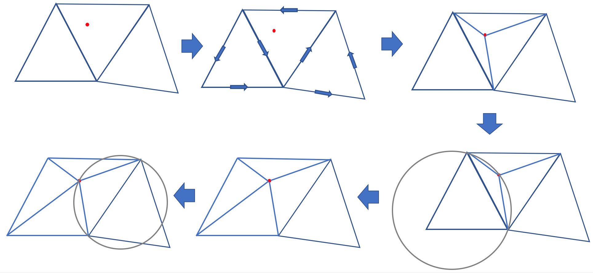

# Parallel Low Poly Style Image/Video Converter

at: https://darkforte.github.io/LowPoly/

[**Project Checkpoint**](https://darkforte.github.io/LowPoly/checkpoint/checkpoint.html)

## Summary

We implemented a parallel low poly style image converter on CUDA. It accepts a picture of any size and converts it to a composition of many single colored triangles. We implemented the workflow of the converter on both CPU and CUDA and tested it on pictures with different sizes. Experiments showed that our CUDA implementation can achieve ~50x speedup compared to the CPU version. 

## Background and Motivation


Low Poly Art is an art style that expresses objects with only a limited number of polygons. It was introduced in early stage computer games when the computers were not so powerful as they are today. Nowadays, Low Poly Art becomes a popular style in modern design because it brings an unique abstract and retro-style aesthetic value. There are many converters that can convert an image to low poly style. They are very helpful for designers who need generating low poly style pictures, artists who are looking for new ideas, or ordinary people who do this just for fun.

The main workflow of making a low poly style picture involves three steps:

* **Point Selection** spreads a series of points on the picture and preserves the structure of the image. The easiest way to do it is to spread the points uniformly on the picture. However, in order to preserve the picture structure, it would be better to first extract the edges in the picture, then spread more points on the edges than the other parts.

* **Triangulation** connects the points to form a triangle mesh. The most common algorithm is Delaunay Triangulation (DT). This is the most tricky part in the workflow, which will be explained in detail later.

* **Rendering** re-draws the picture using the triangle mesh. Usually it renders each triangle to the color at its center.

All three parts can benefit from parallel execution on GPU. Among them, Delaunay Triangulation (DT) is the most computational expensive part, and it is more tricky to parallelize than the other two. DT refers to a triangulation on a set of points so that no point is inside the circumcircle of another triangle. A common DT algorithm for CPU is the Bowyer–Watson Algorithm. The workflow of this algorithm is:

1. Add a super triangle that includes all the points;

2. Iteratively add points to the current triangle mesh. As shown in the following picture, adding a new point will form three new triangles. Then, it checks whether there is a triangle whose vertex is in the circumcircle of the new triangle (thus violating the Delaunay condition). If yes, then the common edge of the two triangles is flipped.

   

3. Keep adding the points. After adding all the points, removing the super triangle gives the DT of the points.

This algorithm is straightforward, but it is hard to parallelize. The reason is that this algorithm is essentially iterative, and parallelizing it will introduce huge contention. We cannot add two points simultaneously if they are in the same triangle because both points want to modify it. This restriction severely hampers the potential for parallelism of this method.

Some previous attempts used the divide and conquer algorithm to leverage the parallelism in it. For example, Prakash implemented an [OpenMPI version of DT](https://cse.buffalo.edu/faculty/miller/Courses/CSE633/adarsh-prakash-Spring-2017-CSE633.pdf) with the divide and conquer algorithm. The basic idea of the algorithm is to split the points into two areas, do DT in each area, then merge the points on the borders. Although natural to parallelize, this algorithm is much harder to implement, and the communication overhead between processors has great impact on the overall speedup. Even if data fits in a single machine, using 32 cores can only bring 5x speedup.

Since these methods are hard to parallelize, we used a third algorithm that is more suitable for parallel machines. The basic idea is to first compute a Voronoi Graph (VG) of the original picture, which is known to be the dual problem of DT, then obtain the DT with the computed VG. Computing VG can be parallelized on GPU. We will explain the details in the next section.

## Methods

### Overview

Here is an illustration of our workflow. It consists of several steps:

1. Detect the edges of the picture, to better choose the points to preserve the picture structure;
2. Randomly choose points, with more probability on edges than other parts;
3. Compute the VG of the points;
4. Obtain DT mesh from the VG;
5. Render the triangles and produce the final output.


We developed the whole system with C++ and CUDA on GHC machines with GTX 1080 GPU. We also used OpenCV for some helpers like reading and storing images.

### Edge Detection

(Todo)

### Voronoi Graph

For triangulation, we used an algorithm that is proposed by [Rong et al](http://citeseerx.ist.psu.edu/viewdoc/download?doi=10.1.1.632.1946&rep=rep1&type=pdf). The basic idea is, instead of directly computing DT, we first compute the [Voronoi Graph (VG)](https://en.wikipedia.org/wiki/Voronoi_diagram) of it on the picture. VG is a partition of a plane into regions according to their nearest points. VG is the dual problem of DT, if we obtained a VG (dashed lines), then connect the points of adjacent regions of the diagram gives us the DT (solid lines). 


Computing VG on a picture is done by the Jump-Flooding algorithm, which will mark each pixel with its nearest neighbor point. In each iteration with a step size $k$, a pixel $(x, y)$ will look at its eight neighbors $(x+i, y+j)$ where $i, j \in \{-k, 0, +k\}$, and try to find a closer point to it. The pseudo code for Jump-Flooding algorithm is:

```
owner = {}
step = picture_size / 2
while step>=1:
    for pixel_A in pixels:
        for pixel_B who is (step) away from pixel_A:
            if pixel_A has no owner, or owner[pixel_B] is closer than owner[pixel_A]:
                owner[pixel_A] = owner[pixel_B]
    step /= 2
```

Here is a illustration for the steps for the Jump-Flooding algorithm on three points, with initial step = 4.


This algorithm is very GPU friendly since we can parallel the computation by each pixel. We can map each pixel to a thread on GPU, and each thread looks at the eight neighbors and update their owner points. Each step size requires a kernel launch, so there will be $\log{N}$ kernel launches where $N$ is the larger size of the picture. We use double buffers to implement this algorithm, since the updating process is fully synchronous. There is no contention in this algorithm.

### Generating Triangles

After getting the VG, there is a neat trick to generate the triangle mesh in a fully parallel way. It turns out that the pixel map is sufficient to construct the triangles. Specifically, our task is find 2x2 squares in the pixel map that have 3 or 4 different owners. A square of 3 owners suggests those 3 regions intersect here, so one triangle should be generated to connect the 3 regions. Similarly, a square of 4 owners suggests there should be two triangles to connect the 4 regions. Here is an illustration of this process. The number in the pixel refers to the number of owners in the 2x2 square.


Since we cannot dynamically add triangles in CUDA, constructing the triangle mesh is a two step process:

First, we compute the total number of the triangles, and assign each pixel with their triangle indices. This can be done by mapping each pixel to a thread, then each pixel checks itself and the three pixels on its right, bottom and bottom-right. If the total number of different owners is 3, then mark the pixel as 1; or if it is 4, them mark the pixel as 2. Otherwise it is 0. 

After that, we produce an exclusive scan to get the prefix sum of the pixel map. The exclusive scan gives the total number of triangles and the index of each pixel. For example, if prefix_sum[pixel_A] = 10, and prefix_sum[pixel_next_to_pixel_A] = 12, we know that pixel_A has two triangles: the 10th and the 11th. We use `thrust::exclusive_scan` to carry out this process.

At last, we allocate an array whose length is equal to the number of triangles, then launch another kernel in which every pixel puts their triangle to the corresponding indices.  

The whole process in generating triangles does not contain any contention, since all information a pixel relies on is the pixel map generated in the previous step.

### Rendering

(Todo)

### Side Notes

* It is worth noting that our algorithm is especially suitable for generating low poly arts instead of computing general Delaunay Triangulation. Computing DT in this methods requires additional steps on mapping the points to a fixed sized texture, restoring the mapped points to their original coordinates, handling missing points, and flip edges that violates Delaunay properties. Fortunately, generating low poly arts essentially has a texture and all points are on the texture from the very beginning, so it is unnecessary to map the points, which reduces a lot of trouble. 
* Jump-Flooding algorithm does not always produce perfect Voronoi Graphs. It can sometimes produce "islands" like the following situation. However, it rarely happens and we never observed it crashing the output picture during experiments, so we did not include the step that fixes the islands. This can also be done by parallel pixel examination. 
* Sometimes our output picture will have some missing triangles on edges (like the output image of the first picture in the report). In order to fix the edges, a standard way is to transfer the image back to CPU and fit a convex hull of all the points. However, we think it is unnecessary because small missing triangles does not hurt the output quality much, but transferring it back and fit a convex hull will significantly increase the computation time. 

## Results


|         | Edge Detection | Select Vertices | Generate Voronoi | Triangulation | Rendering | Other | Total |
| ------- | -------------- | --------------- | ---------------- | ------------- | --------- | ----- | ----- |
| CPU -O0 | 60             | 50              | 6710             | 1430          | 180       | 60    | 8490  |
| CPU -O3 | 70             | 80              | 1300             | 440           | 60        | 40    | 1990  |
| GPU -O3 | 0.2            | 2.4             | 30               | 10            | NI        |       | 350   |

As shown in the above form, we tested our current algorithm with a 1920x1080 image and 1000 random vertices. NI here means "Not Implemented". We are able to achieve about 4x overall speedup for now, compared to `-O3` compiled CPU code.  We have not fine tuned the GPU version performance yet, but we suppose it is due to memory transferring from CPU to GPU. We believe a lot of memory transferring can be saved after we implemented the GPU version of edge detection and triangle rendering, which will improve the performance of our program. Also we are using `std::clock()` for clocking now. We may switch to a higher precision timer, like the `CycleTimer` used in HW2, to get more accurate profiling data.

### Failed Attempts and Ideas

* In parallel triangle generation, we found that a pixel can be accessed multiple times. Therefore, we considered loading the owner array to the block's shared memory before the actual computation. However, we tried it out and the performance did not improve. We suppose the reason is that when reading pixels into shared memory, the workload is actually imbalanced, because while the majority of threads just reads their own pixels, the threads on borders will have to read 2 pixels, and the bottom-right thread will have to read 4. In that way, the overhead introduced by loading data into shared memory will cancel out the benefit of accelerated memory access.

* Parallel by row?

## Goals Summary

### Expected Goals (Plan to achieve):

* Make a program that loads a picture from disk, use Sobel Edge Detector to spread points, triangulates the image, then store and shows the low poly style image. 
* Implement the Sobel Edge Detector, Parallel Jump Flooding Algorithm and Triangle Rendering with CUDA.
* Achieve real-time computation speed (30fps), and more than 10x speedup compared to sequential CPU version using the same algorithm. The number comes from the report of MPI version, which is about 5x. Since we don't need the merge step, the number should be higher than the MPI version. 

### Minimum Goals:

* Finish the parallel version of Delaunay Triangulation and achieve at least 5x speedup compared to CPU version.
* Complete image input/output features to have displayable demos.

### Ideal Goals (Hope to achieve):

* Make a close real-time triangulation converter for video, and achieve better speedup on videos than processing individual frames since the frames in video are correlated.

## References

- We are going to start from scratch for this project. There are some former implementations, but they are too complicated. If we have time, we can compare the performance with some of these versions.
- There are some former attempts to parallelize Delaunay Triangulation with CPU, like [https://cse.buffalo.edu/faculty/miller/Courses/CSE633/adarsh-prakash-Spring-2017-CSE633.pdf](https://cse.buffalo.edu/faculty/miller/Courses/CSE633/adarsh-prakash-Spring-2017-CSE633.pdf) which uses OpenMPI to parallelize the algorithm. We will compare our performance with this version. We expect to achieve higher speedup than it.
- We are referring to [http://www.cs.utah.edu/~maljovec/files/DT_on_the_GPU_Print.pdf](http://www.cs.utah.edu/~maljovec/files/DT_on_the_GPU_Print.pdf), [http://rykap.com/graphics/skew/2016/02/25/voronoi-diagrams/](http://rykap.com/graphics/skew/2016/02/25/voronoi-diagrams/) and [https://www.comp.nus.edu.sg/~tants/delaunay/GPUDT.pdf](https://www.comp.nus.edu.sg/~tants/delaunay/GPUDT.pdf) as guidance to our implementation. 