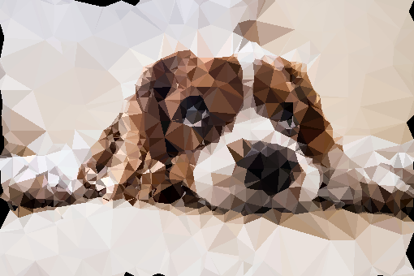

# Checkpoint Report

## Summary

We have finished the CPU version of the entire workflow, including edge detection, Delaunay triangulation and triangle rendering. The outcome is satisfactory. 

 

We also resolved a couple of compiling issues and finished the GPU version which outputs correct images. But its speedup is not yet satisfactory. We need to profile and tune the performance of the GPU version to make it run faster. Also, as can be seen in the picture, we need to find a way to take care of the edges. And we need to implement Sobel Edge Detector and Triangle Rendering in the next few weeks.

## Goals and Deliverables

We are still on the track to our planned goals and things are working out smoothly. The algorithm turned out to be easier to implement than imagined, and we believe we are able to deliver everything in the planned goals. We annotated the progress of each item in bold texts.

### Expected Goals (Plan to achieve):

- Make a program that loads a picture from disk, use Sobel Edge Detector to spread points, triangulates the image, then store and shows the low poly style image. **(Completed the workflow!)**
- Implement the Sobel Edge Detector, Parallel Jump Flooding Algorithm and Triangle Rendering with CUDA. **(Parallel Jump Flooding and Triangulation finished, the others are now using opencv)**
- Achieve real-time computation speed (30fps), and more than 10x speedup compared to sequential CPU version using the same algorithm. The number comes from the report of MPI version, which is about 5x. Since we don't need the merge step, the number should be higher than the MPI version.  **(Now the speedup is not satisfactory, we need more profiling on that)**

### Minimum Goals:

- Finish the parallel version of Delaunay Triangulation and achieve at least 5x speedup compared to CPU version. **(Triangulation finished, speedup needs tuning)**
- Complete image input/output features to have displayable demos. **(Done!)**

### Ideal Goals (Hope to achieve):

- Make a real-time triangulation converter for video, and achieve better speedup on videos than processing individual frames since the frames in video are correlated. **(Not started yet)**

## Preliminary Results

We are able to achieve 3x speedup for now, compared to `-O3` compiled CPU code. We have not investigated profiled the GPU code yet, but we suppose it is due to memory transferring from CPU to GPU. If we implemented the GPU version of edge detection and triangle rendering, a lot of memory transferring can be saved, which will improve the performance of our program.

## Concerns

We still don't know how good our final speedup will be. Also, we are not sure whether we should implement a CPU-friendly algorithm to compare the performance of CPU and GPU. Moreover, we are not sure whether we can finish the video transformation (the Ideal Goal listed above).

## Revised Schedule

| Time              | Work                                                         | Status  |
| ----------------- | ------------------------------------------------------------ | ------- |
| 10.29 - 11.4      | Write proposal, research for existing work                   | Done!   |
| 11.5 - 11.11      | Complete sequential version of Sobel Edge Detector and Jump Flooding | Done!   |
| **11.12 - 11.18** | Complete CUDA version of Delaunay Triangulation, prepare for Checkpoint | Done!   |
| 11.19 - 11.25     | Complete CUDA version of Sobel Edge Detector and Triangle Rendering |         |
| 11.26 - 12.2      | Performance tuning and analysis                              | Working |
| 12.3 - 12.9       | Complete image input and output interface, get ready for demo |         |
| **12.9 - 12.15**  | Final Report                                                 |         |