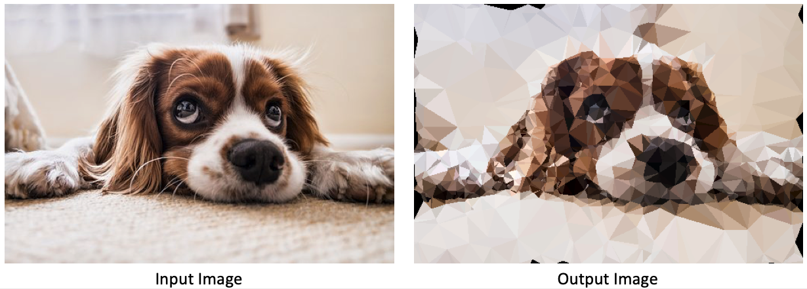

# Checkpoint Report

## Summary

- We have implemented the CPU version of the entire workflow by ourselves from scratch, including edge detection, point selection, Voronoi graph generation, and triangle rendering. 
- We also finished our first GPU version which can now generate correct outputs. We struggled a lot and resolved a couple of compiling issues during the implementation of GPU version. 
- The speedup of GPU version is not yet satisfactory (about 4x). We need to profile and tune the performance of the GPU version to make it run faster. 
- As can be seen in the picture, we need to find a way to take care of the image boundaries. 

## Goals and Deliverables
In general, we are still on the track to our planned goals and things. But we want to change our goal from 30fps to 10fps. The reason is we realize that loading the image, transfering data between CPU and GPU, and storing the output image will take 40~60ms. We expect to reduce these time consumption, but achiving an overall 30fps (33ms per image) would be too hard now.

### Expected Goals (Plan to achieve):

- Make a program that loads a picture from disk, use Sobel Edge Detector to detect edges, select vertices on image, triangulates the image, rendering the low poly image, then store and shows the low poly style image. **(Completed the workflow!)**
- Implement Sobel Edge Detector, Vertices selection, Parallel Jump Flooding Algorithm and Triangle Rendering with CUDA. **(Parallel Jump Flooding and Triangulation finished, the others are now using opencv)**
- Achieve close real-time computation speed (10fps), and more than 10x overall speedup compared to sequential CPU version using the same algorithm. The number comes from the report of MPI version, which is about 5x. Since we don't need the merge step, the number should be higher than the MPI version.  **(Now the speedup is not satisfactory, we need more profiling on that)**

### Minimum Goals:

- Finish the parallel version of Delaunay Triangulation and achieve at least 5x speedup compared to CPU version. **(Triangulation finished, speedup needs work)**
- Complete image input/output features to have displayable demos. **(Done!)**

### Ideal Goals (Hope to achieve):

- Make a close real-time triangulation converter for video, and achieve better speedup on videos than processing individual frames since the frames in video are correlated and some data can be reused. **(Not started yet)**

### Deliverables:
- A demo program that can take an image as input, then output a low poly style image.
- A form about speedup.
- (Hopefully) A demo program that can take and video as input, then output a low poly style video.
- (Hopefully) Connect our demo program with a camera.

## Preliminary Results

|              | Edge Detection | Select Vertices | Generate Voronoi | Triangulation | Rendering | Other | Total |                                       
| ------------ | ---------------|-----------------|------------------|---------------|-----------|-------|-------|
|  CPU -O0     |       60       | 50 | 6710 | 1430 | 180 | 60 | 8490 |   
|  CPU -O3     |       70       | 80 | 1300 | 440 | 60 | 40 | 1990 | 
|  GPU -O3     | NI | NI | 30 | 10 | NI |  | 430 |                                      

As shown in the above form, we tested our algorithm with a 1920x1080 image and 1000 random vertices. NI here means "Not Implemented". We are able to achieve about 4x overall speedup for now, compared to `-O3` compiled CPU code.  We have not fine tuned the GPU version performance yet, but we suppose it is due to memory transferring from CPU to GPU. We believe a lot of memory transferring can be saved after we implemented the GPU version of edge detection and triangle rendering, which will improve the performance of our program.

## Concerns
- There is a trade off. To speedup edge detection and vertices selection, we need to implement them on GPU. But in order to do this, we need to transfer image between CPU and GPU. If we do the edge detection and vertices selection on CPU, we can avoid transfer image between CPU and GPU. So, here is a trade off between data time and computation time.
- Due to the limitation of current the algorithm, we are not able to gurantee to cover the boundaries of the image. We need to figure out a strategy to solve this problem without influencing the speed much.
- We still don't know how good our final speedup can be. 
- We are not sure whether we will have time to do the video transformation (the Ideal Goal listed above).

## Revised Schedule

| Time              | Work                                                         | Status  | Mainly Responsible |
| ----------------- | ------------------------------------------------------------ | ------- | ----------- |
| 10.29 - 11.4      | Write proposal, research for existing work                   | Done!   | Both |
| 11.5 - 11.11      | Complete sequential version of Sobel Edge Detector and Jump Flooding | Done!   | Both |
| **11.12 - 11.18** | Complete CUDA version of Delaunay Triangulation, prepare for Checkpoint | Done! | Both |
| 11.19 - 11.25     | Complete CUDA version of Sobel Edge Detector and Triangle Rendering |         | Zhengjia |
| 11.26 - 12.2      | Performance tuning and analysis                              | Working | Weichen |
| 12.3 - 12.6       | Solve the current problem on the image boundaries            |         | Weichen |
| 12.7 - 12.9       | Complete image input and output interface, get ready for demo |         | Zhengjia |
| **12.9 - 12.15**  | Final Report                                                 |         | Both |